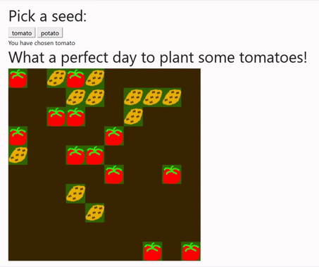

# PlantsApp

## Spis treści
* [Opis projektu](#Opis)
* [Prezentacja działania](#Prezentacja)
* [Autorzy](#Autorzy)

## Opis
Projekt został wykonany w ASP .NET Core. Celem projektu była nauka języka C#.

Założeniem projektu było, aby użytkownik mógł prowadzić wirtualną plantację roślin.
Na prędkość rośnięcia roślin miała mieć wpływ pogoda oraz częstotliwość podlewania przez użytkownika.

Nie wszystkie założenia zostały spełnione. Aplikacja umożliwia sadzenie roślin, jednak nie zaimplementowano ich rośnięcia.
Pogoda dla Wrocławia jest pobierana z zewnętrznego API, jednak nie wpływa w żaden sposób na rośliny.

#### Technologie/pakiety użyte w projekcie:
- Microsoft Entity Framework - łączenie z bazą danych oraz ORM
- Newtonsoft Json - przetwarzanie pliku JSON pobranego z zewnętrznego API (pogoda) 
- NLog - tworzenie logów
- XUnit - testy

W projekcie zastosowano również metody asyncroniczne - API w Seed Controller.

Dodatkowo w projekcie zastosowano wzorzec MVC - Model-View-Controller 

## Prezentacja
Poniższy gif obrazuje sposób "sadzenia" roślinek:

	
## Autorzy

- Piotr Grzelczak
- Adrian Baran
- Tomasz Filip
